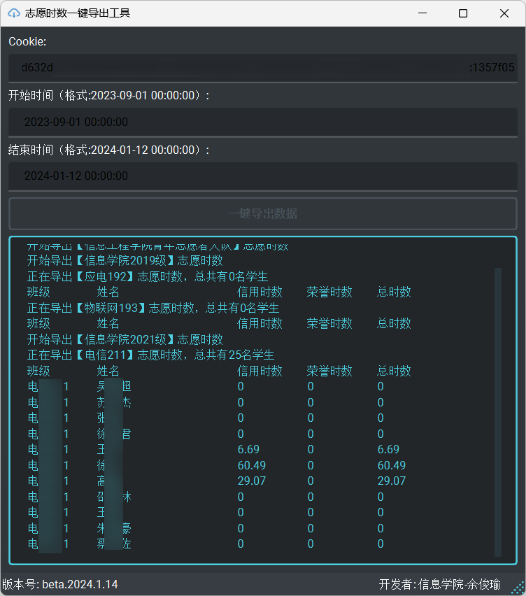

# 志愿时数一键导出

## 介绍
本工具旨在导出志愿时数，并且提供了简介的操作界面，可以快速导出志愿汇服务管理平台的数据

## 界面预览

## 软件特色：
- 界面简洁，操作简单，**傻瓜式一键导出**志愿时数，
- 输出格式为csv，也就是**Excel格式**；
- 支持导出**指定区间时间**的志愿时数（含信用时数、荣誉时数）；
- **各二级学院均可使用**，网页登录账号获取cookie后，即可使用本工具导出；
- 所有的特色，都是为了减轻工作量，为了更好地摸鱼~ 心动吗~😀

## 技术支持
如果使用过程中，有任何问题可咨技术支持🐟 :2933582448(qq)

